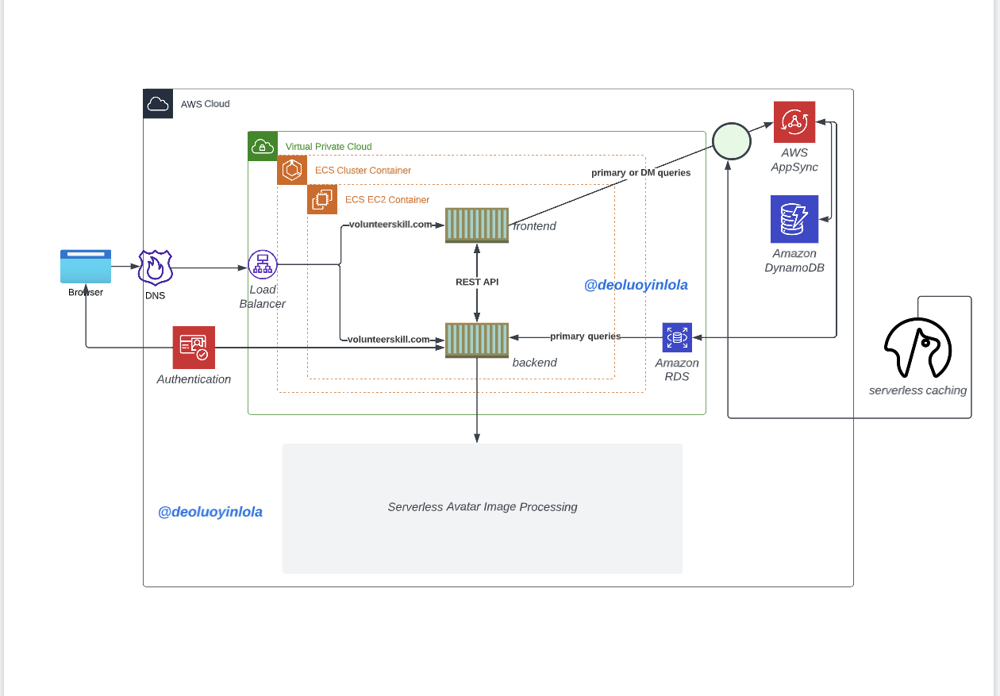

# Week 0 — Billing and Architecture

## Required Homework
### aws account set up
- I created AWS Organisation, so I can maintain one main account to manage two other account for PROD and DEV for this projects

- I also attached below a copy of AWS CLI, using `aws get-caller-identity` command

### github account set up
- I created a repo for this project title; aws-bootcamp-cruddur-2023

### lucid chart
- Below is the screeshot for the chart

- [My lucid chart for the project](https://lucid.app/lucidchart/0b2febc4-eaf3-425d-932b-8548cd176fb7/edit?viewport_loc=-11%2C-11%2C1276%2C779%2C0_0&invitationId=inv_23463428-c5a6-430e-9fc5-dc27f42a47b7)

- I was able to achieved the above chart with the help of this YouTube video;[from Andrew](https://www.youtube.com/watch?v=K6FDrI_tz0k&list=PLBfufR7vyJJ7k25byhRXJldB5AiwgNnWv&index=18)

### gitpod account
- I set up gitpod account following this pretty simple video; [from Gifted lane](https://www.youtube.com/watch?v=yh9kz9Sh1T8&list=PLBfufR7vyJJ7k25byhRXJldB5AiwgNnWv&index=5)

- I also install gitpod badge to my github account with a chrome extension. Watch this video;[from Andrew](https://www.youtube.com/watch?v=A6_c-hJmehs&list=PLBfufR7vyJJ7k25byhRXJldB5AiwgNnWv&index=5)
