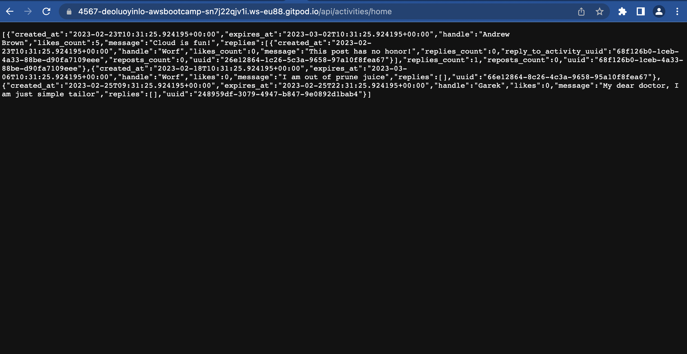
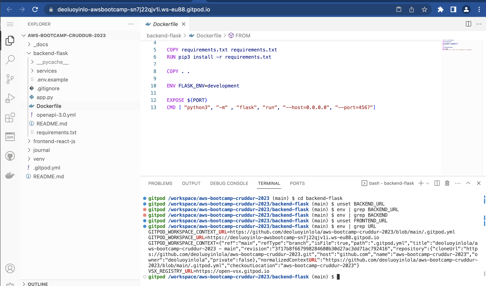
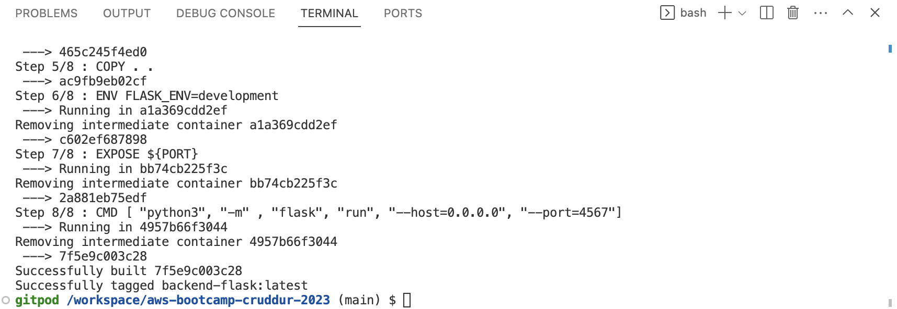
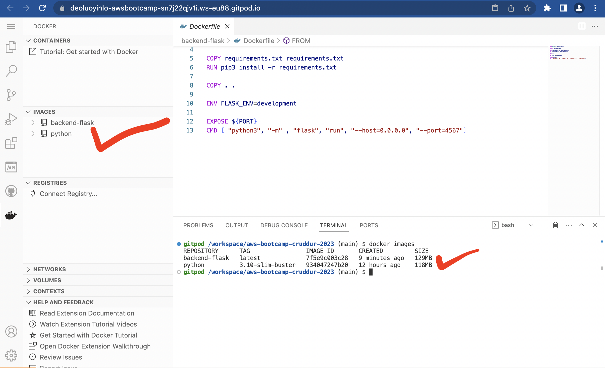

# Week 1 — App Containerization

## Required Homework
### Install flask module
```
cd backend-flask
export FRONTEND_URL="*"
export BACKEND_URL="*"
pip3 install -r requirements.txt
python3 -m flask run --host=0.0.0.0 --port=4567
cd ..
```

- I make sure to unlock the port on the port tab
- I open the link for 4567 in your browser
- I append to the url to /api/activities/home
- I get back json

Above is manual process before exploring Dockerfile, remember to unset the variables(BACKEND_URL and FRONTEND_URL) before building with Dockerfile


### Add Dockerfile
Create a file here: backend-flask/Dockerfile
```
FROM python:3.10-slim-buster

WORKDIR /backend-flask

COPY requirements.txt requirements.txt
RUN pip3 install -r requirements.txt

COPY . .

ENV FLASK_ENV=development

EXPOSE ${PORT}
CMD [ "python3", "-m" , "flask", "run", "--host=0.0.0.0", "--port=4567"]
```

### Build Container
```
docker build -t  backend-flask ./backend-flask
```


Get Container Images or Running Container Ids
```
docker ps
docker images
```


### Run Container
Run
```
docker run --rm -p 4567:4567 -it backend-flask
FRONTEND_URL="*" BACKEND_URL="*" docker run --rm -p 4567:4567 -it backend-flask
export FRONTEND_URL="*"
export BACKEND_URL="*"
docker run --rm -p 4567:4567 -it -e FRONTEND_URL='*' -e BACKEND_URL='*' backend-flask
docker run --rm -p 4567:4567 -it  -e FRONTEND_URL -e BACKEND_URL backend-flask
unset FRONTEND_URL="*"
unset BACKEND_URL="*"
```
Run in background
```
docker container run --rm -p 4567:4567 -d backend-flask
```
Return the container id into an Env Vat
```
CONTAINER_ID=$(docker run --rm -p 4567:4567 -d backend-flask)
```

### Send Curl to Test Server
```
curl -X GET http://localhost:4567/api/activities/home -H "Accept: application/json" -H "Content-Type: application/json"
```

Check Container Logs
```
docker logs CONTAINER_ID -f
docker logs backend-flask -f
docker logs $CONTAINER_ID -f
```

Debugging adjacent containers with other containers
```
docker run --rm -it curlimages/curl "-X GET http://localhost:4567/api/activities/home -H \"Accept: application/json\" -H \"Content-Type: application/json\""
```
busybosy is often used for debugging since it install a bunch of thing

```
docker run --rm -it busybosy
```

### Gain Access to a Container
```
docker exec CONTAINER_ID -it /bin/bash
```
You can just right click a container and see logs in VSCode with Docker extension

### Delete an Image
```
docker image rm backend-flask --force
```
docker rmi backend-flask is the legacy syntax, you might see this is old docker tutorials and articles.

There are some cases where you need to use the --force

### Overriding Ports
```
FLASK_ENV=production PORT=8080 docker run -p 4567:4567 -it backend-flask
```
Look at Dockerfile to see how ${PORT} is interpolated

### Containerize Frontend
Run `npm Install`
We have to run NPM Install before building the container since it needs to copy the contents of node_modules

```
cd frontend-react-js
npm i
```

### Create Docker File
Create a file here: `frontend-react-js/Dockerfile`

```
FROM node:16.18

ENV PORT=3000

COPY . /frontend-react-js
WORKDIR /frontend-react-js
RUN npm install
EXPOSE ${PORT}
CMD ["npm", "start"]
```
