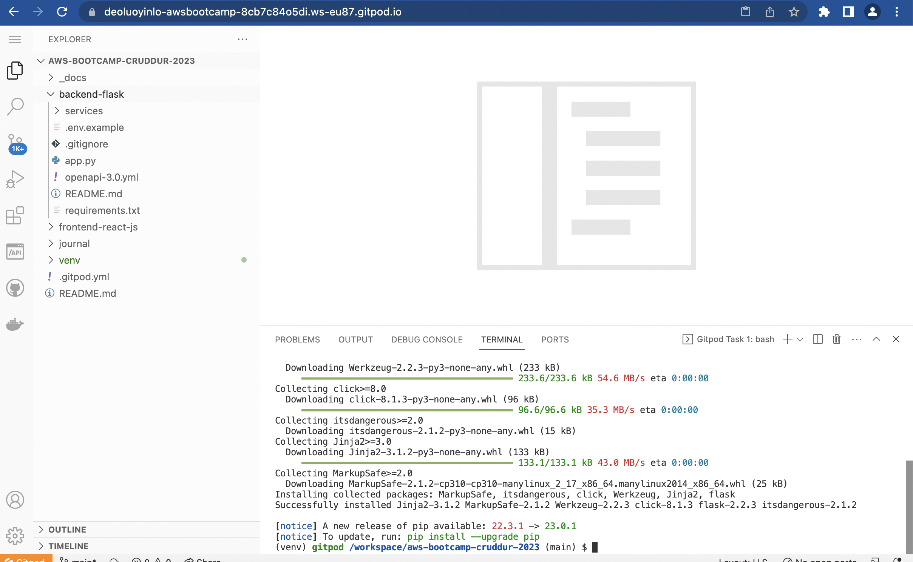

# Week 1 — App Containerization

## Required Homework
### install flask module
```
cd backend-flask
export FRONTEND_URL="*"
export BACKEND_URL="*"
pip3 install -r requirements.txt
python3 -m flask run --host=0.0.0.0 --port=4567
cd ..
```

- I make sure to unlock the port on the port tab
- I open the link for 4567 in your browser
- I append to the url to /api/activities/home
- I get back json
